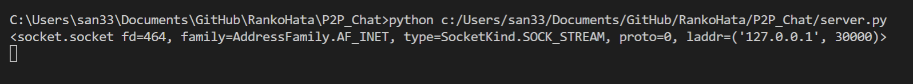
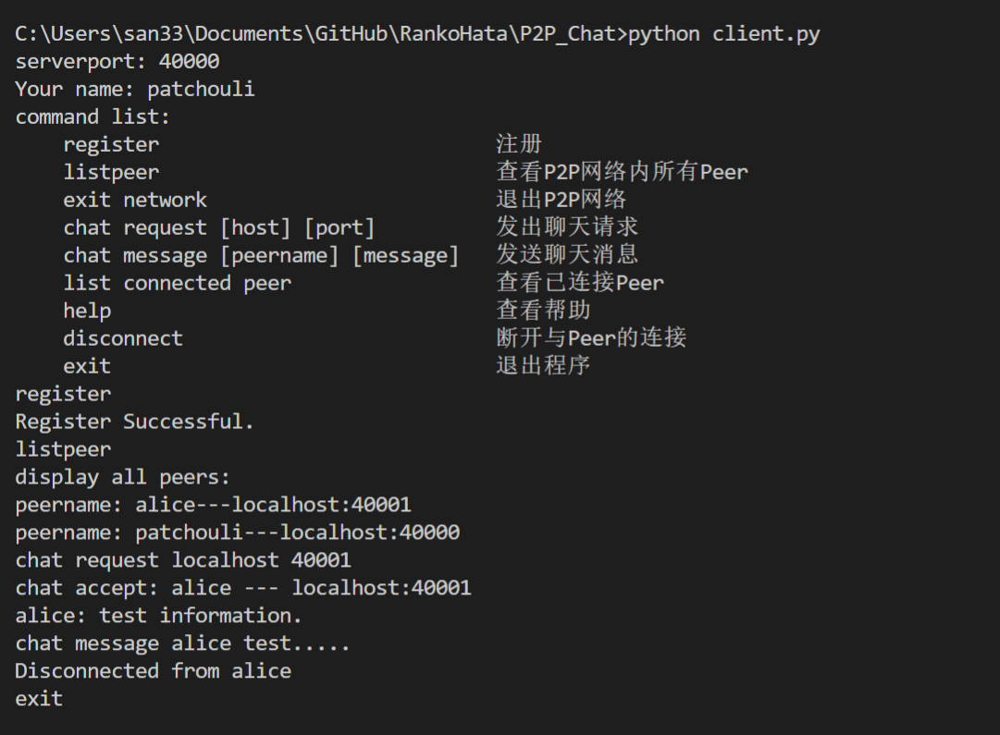
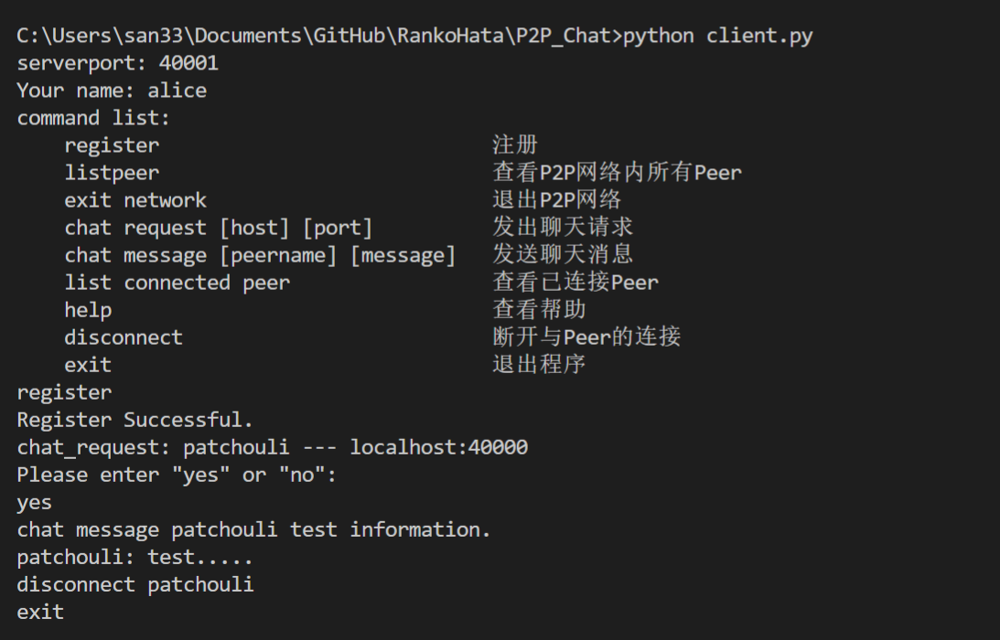

# P2P_Chat

A chat application for a simple P2P network.

- Programming language: Python 3.7.0

- Use only built-in libraries.

## Example

    serverport: 40000
    Your name: patchouli
    
    command list:
        register                            注册
        listpeer                            查看P2P网络内所有Peer
        exit network                        退出P2P网络
        chat request [host] [port]          发出聊天请求
        chat message [peername] [message]   发送聊天消息
        list connected peer                 查看已连接Peer
        help                                查看帮助
        disconnect                          断开与Peer的连接
        exit                                退出程序
    
    >> register
    
    Register Successful.
    
    >> listpeer
    
    display all peers:
    peername: alice---localhost:4000
    peername: patchouli---localhost:40000
    
    >> chat request localhost 4000
    
    chat accept: alice --- localhost:4000
    
    >> chat message alice Hello, alice.
    
    >> disconnect alice
    
    >> exit

Server:

Client_a:

Client_b:

## Detail implementation

### 实现P2P网络的技术选择

P2P网络不依赖中心服务器，是Peer to Peer的技术，所以必须要能够进行不依赖服务器的通信，这里选择TCP套接字进行实现，只要能够获取对方的IP和套接字端口，即可直接与对方进行连接，不必再向中心服务器发送信息。

### 处理信息交互的方式

在本程序中，每个Peer采用一个TCP套接字进行端口监听，实时接收信息。

每次发送消息都使用一个新的套接字进行发送，发送之后即刻关闭。

服务端本质上也是个Peer，只不过是没有发送信息功能的Peer添加了一些额外功能（由于要求必须实现Server，但是如果不需要一些特定的功能，可以只用Peer实现P2P网络，只要每个Peer能连接一个其他的Peer即可）。

### 信息类型

为了方便与易于理解，本程序并未使用struct等库构建结构体，而是对于全部的交互信息都采用JSON格式进行传送。

对于不同的功能，实现了多种信息类型，不同类型的信号，会被以不同方法进行处理，同类型的信号，不同的端(Peer或Server)处理方法也不同。

### 采用面向对象进行开发

基类Peer实现了P2P网络中Peer最基本的功能，并且将特定方法设定为抽象方法，由具体子类进行实现。实际上不同的功能，就对应不同的信息类型，加入新功能，不过是增加新的信息类型和该类型的处理函数而已。

### UI
本程序采用命令行作为用户接口，底层的实现才是最重要的，所以舍弃了花里胡哨的GUI。

命令行交互的问题 <如若使用GUI，该问题不存在>：

由于input和output都在一个shell中，所以如果正在输入中，突然输出一条信息，会导致输入在视觉上被截断（实质上没有任何影响）。

采用命令行，必然会设定为loop input，所以如何在loop input的情况下，回应聊天请求是一个麻烦的问题（在input时，再执行一个input是无效的），所以采用一个全局的信号量，在loop input时就检测用户的应答语句，输入的信息会保存在该信号量里，当收到用户请求时，会输出提示，引导用户输入应答，然后持续检测该信号量，如果获取到信号，执行相应处理，重置信号。（实际上，该信号量并非是特定对应请求的，而是独立的，如果用户在未有请求时，随便输入应答语句，会导致下一次聊天请求自动通过。解决方法： 让该信号量附带一个时间域和一个能够指定Peer信息的特定值，通过时间值和Peer信息，对应答信息进行筛选和判定，去除无效的应答）

### Security

本程序仅仅是一个P2P网络的基本实现，所以没有任何安全保障，默认所有Peer都是诚实的，且无任何人想攻击系统，实际上如果想，每个Peer都可以伪造信息，冒充任何人（包括服务器）。

### Others

如果不使用Server，仍旧可以构建该P2P网络(注意：这是建立在上面所说的默认所有Peer都是诚实的情况下，且无任何人攻击系统)。每个Peer只要能够连接到任何一个其他的Peer，就可以组建一个小的P2P网络，如若该P2P网络中有一个Peer连接到其他网络，该两个P2P网络即可组建为一个更大的P2P网络(举个例子：Patchouli不能直接与Yuuka进行通信，但是在大图书馆里的Patchouli能够与Alice进行通信，太阳花田的Yuuka也能与Alice进行通信，那么Patchouli与Yuuka便能够进行间接通信，即两点之间有一条通路，便为同一个P2P网络)。

## Update Records

### 2018-10-30

#### Basic functions have been implemented.

### 2018-11-05

#### Code optimization.
